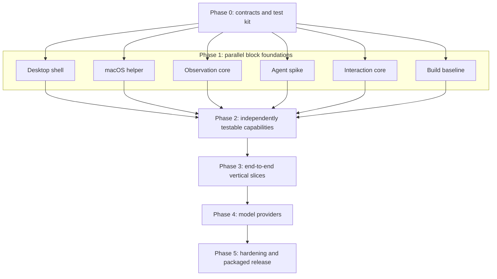
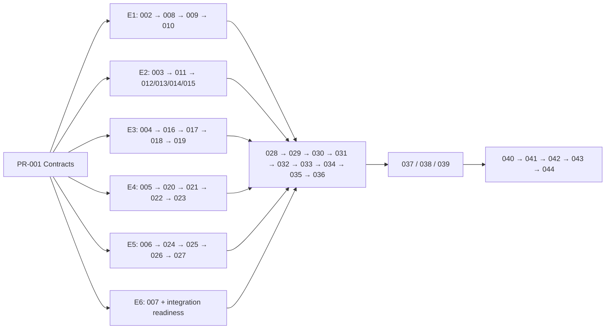

# Pilot MVP 01 Implementation Plan

Status: Draft 0.1  
Last updated: 2026-08-10  
Scope: macOS MVP, with platform boundaries preserved for future Windows support

## Purpose

This document converts the product, system, logical architecture, and M1 engineering plan into an executable PR sequence. The delivery model has three goals:

1. Merge small, reviewable features instead of long-lived feature branches.
2. Keep `main` runnable and demoable after every integration PR.
3. Build large logical blocks in parallel behind stable contracts and test fakes.

This plan implements `docs/mvp-01-point-ask-hear.md`. Architecture details remain authoritative in `docs/system-design.md` and `docs/logic.md`; engineering ownership and effort assumptions remain authoritative in `dp/m1.md`.

## Delivery rules

Every feature is delivered through one PR. A PR must:

- implement one named capability with one primary owner;
- keep `main` buildable and runnable;
- include automated tests or a deterministic standalone test harness;
- document a demo command or a short manual verification procedure;
- expose an explicit failure or unavailable state instead of silently doing nothing;
- avoid unrelated refactors and cross-workstream edits;
- update shared contracts through E6 before depending on a changed interface;
- use fakes only behind the same public contract used by the real implementation.

Integration PRs must replace at most one fake boundary at a time. They must leave an end-to-end path that a reviewer can run without editing source code.

### PR size guide

| Size | Expected effort | Intended scope |
| --- | ---: | --- |
| XS | 1–2 engineer-days | Contract, focused UI state, or narrow test utility |
| S | 2–4 engineer-days | One contained capability with tests |
| M | 4–7 engineer-days | One cross-process or integration capability |
| L | 7–10 engineer-days | Exceptional platform feature; split when possible |

A PR estimated above L should be divided before implementation. Estimates include implementation and tests, not review or external approval time.

## Owners and workstreams

| Owner | Workstream | Primary code |
| --- | --- | --- |
| E1 | Desktop Experience | `apps/desktop/` |
| E2 | macOS Platform | `packages/platform-mac/` |
| E3 | Observation Engine | `packages/observation/` |
| E4 | Agent Runtime | `packages/agent-runtime/` |
| E5 | Voice and Interaction | `packages/interaction/` |
| E6 | Contracts, Integration, and Release | `packages/platform/`, `packages/shared/`, root config, `tests/` |

The owner named below implements the PR. At least one engineer from a consuming or producing workstream reviews contract-facing changes.

## Execution overview

Phase numbers describe dependency gates, not serial staffing. Within a phase, PRs marked parallel may proceed simultaneously after their prerequisites merge.

## Phase 0 — Contract and test foundation

### PR-001 — Workspace, contracts, fakes, and CI

- Owner: E6
- Size: M
- Depends on: none
- Parallel: no; this is the initial gate
- Tasks:
  - Create the pnpm workspace and TypeScript project references.
  - Add lint, unit-test, typecheck, build, and CI commands.
  - Define versioned shared IDs, geometry, errors, IPC envelopes, and adapter interfaces.
  - Add fakes for platform, observation, agent, speech, and interaction boundaries.
  - Add privacy-safe structured logging with binary, audio, and credential-field rejection.
- Tests:
  - Schema round trips and invalid-message rejection.
  - Geometry conversion fixtures for Retina and multi-display coordinates.
  - Logger redaction fixtures.
- Demo: run the complete workspace check and one fake adapter contract test.
- Exit gate: E1–E5 can compile against contracts without importing each other's implementation.

## Phase 1 — Parallel block foundations

All six PRs in this phase may start after PR-001. Each block must run independently through a harness or fake dependency.

### PR-002 — Desktop shell

- Owner: E1
- Size: M
- Depends on: PR-001
- Tasks: Electron lifecycle, single-instance lock, menu bar item, floating panel, validated renderer IPC client, and fake view state.
- Tests: renderer smoke tests and main-process lifecycle tests.
- Demo: launch the app, open/hide the panel, and render fake idle/listening/error states.

### PR-003 — Native helper transport

- Owner: E2
- Size: M
- Depends on: PR-001
- Tasks: SwiftPM helper, framed stdio protocol, echo/health commands, process supervision, protocol limits, and crash reporting.
- Tests: framing, oversized input, malformed header, restart, and request correlation.
- Demo: run the helper harness and exchange typed request/response plus a binary fixture.

### PR-004 — Observation core

- Owner: E3
- Size: S
- Depends on: PR-001
- Tasks: bounded frame ring, pointer timeline, scene identity/revision, deterministic clear, and fake frame fixtures.
- Tests: time/byte eviction, nearest-frame selection, scene changes, and clear behavior.
- Demo: feed recorded fixtures and inspect selected frame and buffer statistics.

### PR-005 — Pi Agent Core capability spike

- Owner: E4
- Size: M
- Depends on: PR-001
- Tasks:
  - Pin exact Pi package versions.
  - Prove session creation, streaming, typed tools, image tool results, abort/steer, and compaction.
  - Probe Codex subscription authentication, one API-key model, and one local OpenAI-compatible endpoint.
  - Prove whether images can be excluded from durable session storage.
  - Record findings and expose a provider-independent fake-compatible facade.
- Tests: recorded fake-provider session and tool-event contract tests.
- Demo: send a text prompt and execute a fake `observe_screen` tool call through Pi.
- Exit condition: unsupported or uncertain APIs are recorded before product code depends on them.

### PR-006 — Interaction state machine

- Owner: E5
- Size: S
- Depends on: PR-001
- Tasks: interaction states, commands/events, utterance identity, stale-result rejection, interruption, and fake speech/agent adapters.
- Tests: full transition table, illegal transitions, cancellation, and late-event rejection.
- Demo: scripted fake flow from idle to listening, thinking, speaking, interrupted, and idle.

### PR-007 — Development build baseline

- Owner: E6
- Size: S
- Depends on: PR-001
- Tasks: electron-vite wiring, Swift helper build hook, electron-builder development config, CI artifact smoke build, and repository run instructions.
- Tests: clean checkout build and packaged-resource presence check.
- Demo: produce and launch a development app bundle containing the helper stub.

### Phase 1 gate

- All public facades compile against their fakes.
- Desktop, helper, observation, agent, and interaction harnesses run independently.
- Pi and macOS helper risks are documented.
- The development app bundle launches without a separately managed process.

## Phase 2 — Independently testable capabilities

PRs within each lane are ordered. Different lanes run in parallel. A capability remains isolated behind its public facade until Phase 3 integration.

### Desktop lane — E1

#### PR-008 — Permission onboarding UI

- Size: S
- Depends on: PR-002
- Tasks: Screen Recording, Accessibility, Microphone, and Speech Recognition explain/status/retry states using the fake permission adapter.
- Demo: switch fixtures through unknown, denied, restricted, and granted states.

#### PR-009 — Window picker and observation controls

- Size: S
- Depends on: PR-008
- Tasks: window list, selected-window summary, start/pause/resume/change actions, and visible observation indicator.
- Demo: select fake windows and verify control state changes.

#### PR-010 — Conversation and diagnostics panel

- Size: M
- Depends on: PR-009
- Tasks: transcript, streamed response, text input, listening/thinking/observing/speaking/error states, and developer diagnostics.
- Demo: replay a fixture-driven conversation and ring-buffer telemetry.

### macOS platform lane — E2

#### PR-011 — Native permissions and window enumeration

- Size: M
- Depends on: PR-003
- Tasks: TCC status/request commands, parent-bundle attribution validation, stable window IDs, titles, app names, and lifecycle events.
- Demo: list real windows and display all four permission states.

#### PR-012 — Selected-window capture

- Size: L
- Depends on: PR-011
- Tasks: ScreenCaptureKit stream at policy FPS/resolution, fresh capture, screen-lock/window-loss events, and binary frame transport.
- Demo: stream only a selected real window and stop/clear on loss or pause.

#### PR-013 — Pointer and Accessibility grounding

- Size: M
- Depends on: PR-011
- Tasks: pointer samples, normalized geometry, AX hit testing, secure-field flag, and outside-window handling.
- Demo: point across a real window and display aligned element metadata.

#### PR-014 — Native STT and TTS

- Size: L
- Depends on: PR-011
- Tasks: Apple Speech partial/final transcription, on-device preference/disclosure, AVSpeechSynthesizer utterances, stop, and typed errors.
- Demo: transcribe a held recording and speak/interrupt a supplied sentence.

#### PR-015 — Global push-to-talk

- Size: M
- Depends on: PR-011
- Tasks: configurable CGEventTap key down/up, default Right Option, permission fallback, and event coalescing.
- Demo: observe reliable press/release events while Pilot is not focused.

### Observation lane — E3

#### PR-016 — Scene and pointer timeline

- Size: S
- Depends on: PR-004
- Tasks: ingest platform events, scene lineage, pointer anchor lookup, and window-change invalidation.
- Demo: replay recorded events and inspect scene/revision transitions.

#### PR-017 — Screen policy

- Size: S
- Depends on: PR-016
- Tasks: retention, outgoing-image count/size, observation rate, pause/clear, and secure-content rules.
- Demo: run allowed and rejected observation scenarios against fixtures.

#### PR-018 — Image processing pipeline

- Size: M
- Depends on: PR-017
- Tasks: redact, pointer crop, marker, resize, JPEG/PNG selection, encoding, and cancellation.
- Demo: generate approved full-frame and crop artifacts from fixture images.

#### PR-019 — Screen context facade

- Size: M
- Depends on: PR-018
- Tasks: `question`, `current`, and `before-and-after` selection; lineage validation; fresh capture request; typed errors; and compact metadata.
- Demo: call `ScreenContextService.observe()` against recorded and fake-fresh sources.

### Agent runtime lane — E4

#### PR-020 — Model profiles and capability checks

- Size: M
- Depends on: PR-005
- Tasks: provider-neutral profile store, auth facade, endpoint locality, and vision/tool capability gating.
- Demo: validate supported and unsupported fake profiles before a request is sent.

#### PR-021 — `observe_screen` tool

- Size: M
- Depends on: PR-020; uses the `ScreenContextService` contract and fake from PR-001
- Tasks: typed tool schema, screen-context call, image/text result mapping, error mapping, and tool lifecycle events.
- Demo: run a Pi session in which a fake model requests a fixture observation.

#### PR-022 — Visual context pruning and compaction

- Size: M
- Depends on: PR-021
- Tasks: active image limits, obsolete-image replacement, compaction trigger, and truthful scene summaries.
- Demo: run repeated observations while context stays within configured limits.

#### PR-023 — Safe session persistence

- Size: S
- Depends on: PR-022
- Tasks: text-only transcript/summary adapter, clear conversation, and assertions preventing image bytes from reaching disk.
- Demo: restore a text conversation and show that no image payload was persisted.

### Voice and interaction lane — E5

#### PR-024 — Question envelope

- Size: S
- Depends on: PR-006
- Tasks: transcript plus scene/revision/pointer anchor, AX summary, and outside-window representation; no image bytes.
- Demo: create envelopes from recorded pointer timelines.

#### PR-025 — Voice orchestration

- Size: M
- Depends on: PR-024
- Tasks: PTT down/up, STT start/finalize/error, one active utterance, and text-input fallback using fakes.
- Demo: complete a fake spoken question into an agent submission.

#### PR-026 — Response and TTS buffer

- Size: S
- Depends on: PR-025
- Tasks: streamed text accumulation, sentence segmentation, phrase timeout, utterance IDs, and speech completion.
- Demo: stream awkward punctuation and hear ordered fake speech chunks.

#### PR-027 — Interruption and cancellation

- Size: S
- Depends on: PR-026
- Tasks: stop speech, abort/steer active run, clear pending chunks, and reject stale events.
- Demo: interrupt during thinking and speaking without late output resurfacing.

### Phase 2 gate

- Every logical block passes its own contract suite and demo independently.
- No block reaches into another block's private implementation.
- Platform-specific types remain behind `packages/platform`.
- The remaining work is composition and provider/release validation, not missing block internals.

## Phase 3 — End-to-end vertical slices

These PRs merge in order. Each replaces one fake boundary and leaves a runnable demonstration on `main`.

### PR-028 — Observe a real selected window

- Owner: E6 with E1/E2/E3
- Size: M
- Depends on: PR-010, PR-012, PR-013, PR-019
- Tasks: connect picker → macOS capture → local ring → diagnostics; enforce pause, window-loss, and clear paths.
- Demo: select a real window, inspect local frames/pointer target, pause, and verify immediate clearing.

### PR-029 — Text conversation with a real Pi session

- Owner: E6 with E1/E4/E5
- Size: M
- Depends on: PR-010, PR-020, PR-024
- Tasks: connect text input → interaction → Pi → streamed panel response, still using mock observation.
- Demo: hold a multi-turn text conversation with a configured model.

### PR-030 — Model-requested real observation

- Owner: E6 with E3/E4
- Size: M
- Depends on: PR-028, PR-029, PR-021
- Tasks: replace the fake screen-context boundary, expose observing state, and surface policy/tool errors.
- Demo: ask a text question that causes the model to call `observe_screen` and answer from the selected window.

### PR-031 — Point-and-ask with text input

- Owner: E6 with E3/E5
- Size: S
- Depends on: PR-030
- Tasks: anchor pointer/scene metadata at submission and select the matching question-time frame.
- Demo: point at a UI element, type “what is this?”, and receive a grounded answer.

### PR-032 — Real push-to-talk input

- Owner: E6 with E2/E5
- Size: M
- Depends on: PR-014, PR-015, PR-025, PR-031
- Tasks: replace fake PTT/STT, display live transcript, retain in-panel fallback, and handle permission denial.
- Demo: hold Right Option in another app, speak, release, and see the question submitted.

### PR-033 — Spoken response

- Owner: E6 with E2/E5
- Size: S
- Depends on: PR-032, PR-026
- Tasks: replace fake TTS, map native completion/errors, and preserve streamed text UI.
- Demo: hear the answer while it also streams in the panel.

### PR-034 — Complete voice screen-grounding flow

- Owner: E6 with all block owners
- Size: M
- Depends on: PR-033
- Tasks: verify selected window, pointer anchor, voice question, model-requested observation, streamed response, and spoken output as one trace.
- Demo: the MVP “point, ask, hear” scenario works end to end.

### PR-035 — End-to-end interruption

- Owner: E5 with E2/E4/E6
- Size: M
- Depends on: PR-027, PR-034
- Tasks: new PTT stops native speech and cancels/steers the active model run; late events cannot resume old output.
- Demo: interrupt a spoken answer and immediately ask a follow-up.

### PR-036 — Bounded multi-turn conversations

- Owner: E4 with E3/E6
- Size: M
- Depends on: PR-023, PR-035
- Tasks: connect pruning, compaction, text persistence, clear conversation, and memory telemetry.
- Demo: repeat screen questions across scene changes without unbounded images or stale-screen claims.

### Phase 3 gate

- A reviewer can run point → speak → observe → answer → hear from one development app.
- Pause, window loss, and new PTT interruption behave visibly and safely.
- Repeated questions retain useful text context while screen images remain bounded.

## Phase 4 — User-configured model profiles

Provider PRs can be developed in parallel after PR-036, but each merges independently and must pass the same agent contract suite. Exact models are selected by successful capability probes rather than hard-coded assumptions.

### PR-037 — Codex subscription profile

- Owner: E4 with E1/E6
- Size: M
- Depends on: PR-036
- Tasks: Pi-supported Codex sign-in, token lifecycle, UI status/sign-out, vision/tool capability validation, and auth-expiry recovery.
- Demo: sign in without an API key and run the point-ask-hear flow.

### PR-038 — API-key provider profile

- Owner: E4 with E1/E6
- Size: M
- Depends on: PR-036
- Tasks: safe credential storage, provider/model selection, capability probe, invalid-key recovery, and remote-data labeling.
- Demo: configure a verified API-key model and run the same acceptance subset.

### PR-039 — Local OpenAI-compatible profile

- Owner: E4 with E1/E6
- Size: M
- Depends on: PR-036
- Tasks: base URL/model settings, endpoint health, vision/tool capability probe, locality labeling, and clear diagnostics for unsupported models.
- Demo: run Pilot as one app against a locally running compatible model endpoint; no second Pilot service is required.

### Phase 4 gate

- All three profile types use one provider-neutral session interface.
- Unsupported vision/tool combinations are blocked before screen data is sent.
- Credentials never enter renderer state, application logs, or session transcripts.

## Phase 5 — Hardening and release

PR-040 and PR-041 may begin after the provider-neutral flow in PR-036 while PR-037 through PR-039 are in progress. Packaging can proceed once lifecycle and privacy checks pass. The complete provider trio is required only for the acceptance run in PR-043.

### PR-040 — Lifecycle and failure recovery

- Owner: E6 with all owners
- Size: M
- Depends on: PR-036
- Tasks: permission revocation, lock/logout, window closure, helper crash, protected capture, provider-neutral auth failure, STT/TTS failure, request retry, and typed user guidance. Provider-specific recovery remains in PR-037 through PR-039.
- Demo: scripted failure matrix with recovery or safe terminal state for every case.

### PR-041 — Privacy and retention verification

- Owner: E6 with E3/E4
- Size: M
- Depends on: PR-040
- Tasks: verify all buffer-clear paths, inspect persisted files/logs, assert no image/audio/secret persistence, and test observation rate/context limits.
- Demo: automated privacy audit plus manual disk inspection checklist.

### PR-042 — Packaged macOS application

- Owner: E6 with E2
- Size: M
- Depends on: PR-041
- Tasks: bundle helper, entitlements, development signing, first-run permissions, clean-machine installation notes, and no-terminal launch.
- Demo: install and run the packaged app without starting a second Pilot process.

### PR-043 — Acceptance and grounding suite

- Owner: E6 with all owners
- Size: M
- Depends on: PR-037, PR-038, PR-039, and PR-042
- Tasks: add and execute A-01 through A-15, approximately 30 grounding cases, standard/Retina coverage, and latency spot checks.
- Demo: recorded acceptance results with at least 90% grounding accuracy on the curated checklist.

### PR-044 — MVP 01 release candidate

- Owner: E6
- Size: S
- Depends on: PR-043
- Tasks: fix release-blocking defects through separate focused PRs, freeze versions, update README/runbook/known issues, and produce the release artifact.
- Demo: repeat the full scripted point-ask-hear scenario from a clean install.

### Phase 5 gate

- The packaged application meets the MVP definition of done or documents an explicitly accepted exception.
- All acceptance evidence is committed.
- There are no known privacy, data-retention, or unsafe stale-output defects.

## Parallel execution map

Recommended staffing behavior:

- Start PR-001 first.
- Start PR-002 through PR-007 together immediately after PR-001 merges.
- Continue each lane independently through Phase 2; do not wait for real neighboring implementations.
- Give E2 priority support and early review because native permissions/capture are the likely critical path.
- Begin Phase 3 as soon as the specific prerequisites for PR-028 and PR-029 are ready; slower unrelated Phase 2 work does not have to block them.
- Merge provider profiles independently after the provider-neutral vertical flow is stable.

## Dependency and scope control

When a PR discovers a missing contract:

1. The discovering engineer writes the smallest required contract change and fixture expectation.
2. E6 owns or approves a focused contract PR.
3. Producers and consumers update in separate PRs when the change is not backward compatible.
4. No engineer imports another workstream's internal type as a shortcut.

When a capability is too large for one PR, split it by observable behavior, not by arbitrary files. For example, capture transport, selected-window streaming, and fresh capture can be separate PRs if each has its own harness and stable contract.

## Definition of ready for a task

A task is ready when:

- its prerequisite PRs are merged;
- its public input/output contract exists;
- required fake adapters or recorded fixtures exist;
- the owner, reviewer, demo, and failure state are named;
- unresolved product decisions do not materially change its implementation.

## Definition of done for a PR

A PR is done when:

- acceptance behavior and failure behavior both work;
- new logic has proportionate automated coverage;
- the documented demo succeeds from a clean branch;
- logs contain no frames, audio, credentials, or base64 payloads;
- the relevant block contract suite passes;
- `pnpm lint`, `pnpm typecheck`, `pnpm test`, and the affected build pass;
- documentation and known limitations are updated;
- a non-owner has reviewed contract-facing behavior.

## First work to start

1. PR-001 — Workspace, contracts, fakes, and CI.
2. In parallel: PR-002 desktop shell, PR-003 helper transport, PR-004 observation core, PR-005 Pi spike, PR-006 interaction state machine, and PR-007 build baseline.
3. Continue the five capability lanes through Phase 2.
4. Integrate in the exact PR-028 through PR-036 order, preserving a working demo after each merge.
5. Add provider profiles, then harden and package the app.
