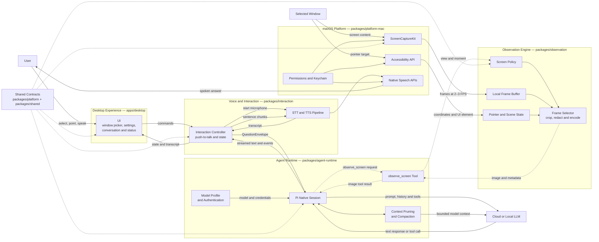

# Pilot Logical Blocks and Connections

Status: Draft 0.1
Last updated: 2026-08-10

## Logical architecture

## Connection meaning

- Solid arrows represent normal runtime connections and data flow.
- Dotted arrows represent the on-demand screen observation path initiated by the LLM.
- Continuous capture flows only from the selected window into the local frame buffer.
- Background frames are not sent automatically to the model.
- The model receives screen pixels only after it calls `observe_screen` and the screen policy approves the request.
- Shared contracts define the boundaries between independently owned feature blocks.

## Block connections

| From | To | Connection |
| --- | --- | --- |
| Desktop Experience | Interaction Controller | User commands and UI actions |
| Interaction Controller | Pi Native Session | `QuestionEnvelope` |
| Pi Native Session | Configured LLM | Prompt, conversation history, and tool definitions |
| Configured LLM | Pi Native Session | Text deltas or tool calls |
| Pi Native Session | `observe_screen` | Tool invocation |
| `observe_screen` | Screen Policy | Requested view and moment |
| macOS Platform | Observation Engine | Frames, pointer coordinates, and accessibility target |
| Observation Engine | `observe_screen` | Policy-approved image and metadata |
| Pi Native Session | Interaction Controller | Response stream and lifecycle events |
| Interaction Controller | Native Speech | Speakable sentence chunks |
| Interaction Controller | Desktop Experience | State, transcript, response, and errors |

## Security boundary

Only the Observation Engine can access raw captured frames through the Platform Adapter. The Agent Runtime receives images exclusively through the policy-controlled `observe_screen` tool. The renderer never receives provider credentials or unrestricted native capture handles.
