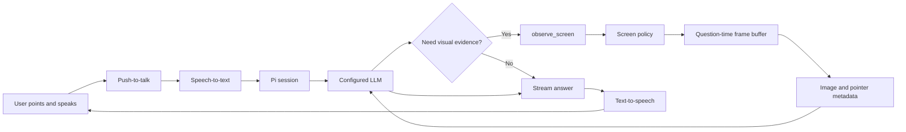

# MVP 01: Point, Ask, Hear

Status: Draft 0.1
Last updated: 2026-08-10

## 1. Objective

Prove the core Pilot experience on macOS:

> A user selects one window, points at something, asks a spoken question, and hears an answer grounded in the selected window and pointer target.

This MVP is a complete vertical slice. It is intentionally not a general computer-control agent, a polished multi-provider marketplace, or an always-listening assistant.

## 2. Demo scenario

The release candidate must complete this demonstration without developer tools or a second user-managed process:

1. Launch Pilot.
2. Grant Screen Recording, Accessibility, and Microphone permissions.
3. Configure a vision- and tool-capable model through Pi.
4. Select a visible application window.
5. See a clear “Observing” indicator naming that application.
6. Point at a button, field, chart value, or error message.
7. Hold the push-to-talk shortcut and ask, “What is this?”
8. Pilot transcribes the question.
9. The LLM calls `observe_screen` when it needs visual evidence.
10. Pilot returns a question-time screenshot, pointer crop, pointer coordinates, and accessibility metadata.
11. The model produces a grounded response.
12. Pilot displays and speaks the response.
13. Ask a follow-up question and receive a context-aware answer.
14. Interrupt the spoken response with another push-to-talk request.
15. Pause observation and verify that local screen capture stops immediately.

## 3. Product boundary

### Included

- Signed or development-signed macOS desktop application.
- Electron main process and React/TypeScript renderer.
- One selected-window observation session.
- Embedded macOS capture/accessibility helper started automatically by Pilot.
- Low-rate local frame ring buffer.
- Pointer timeline and accessibility hit testing.
- Push-to-talk speech input.
- Streaming text response and native speech output.
- Pi Agent Core agent loop and native session.
- Pi provider/model integration.
- `observe_screen` tool with pointer, window, both, and comparison views.
- Screen policy that bounds capture, image size, active visual context, and retention.
- Conversation continuity and basic compaction.
- Visible permissions, observation, listening, thinking, speaking, paused, and error states.
- Text input fallback.

### Excluded

- Clicking, typing, scrolling, or executing arbitrary computer actions.
- Filesystem, shell, browser automation, or code-execution tools.
- Always-on microphone, wake word, or background voice activation.
- More than one selected window.
- Full-display capture fallback.
- Persistent screenshot history.
- Windows implementation.
- Linux, mobile, and browser extension.
- Cloud sync, accounts, billing, and team features.
- Automatic provider routing.
- General OCR pipeline unless required as a fallback for the chosen test model.

## 4. Working assumptions

- The initial development target is macOS 14 or newer. The launch minimum will be revisited after the native capture spike.
- The selected model must support both image input and tool calling.
- Pi packages use the `@earendil-works` scope and are pinned to exact versions.
- Pilot uses Pi Agent Core plus Pi's model/provider package; it does not use Vercel AI SDK.
- The initial provider path may be configured for development, but the MVP UI must expose the selected provider and model and allow credentials or a supported sign-in flow to be changed.
- Subscription authentication is offered only for providers explicitly supported by the pinned Pi release.
- Local model support means a user can configure a compatible local endpoint. Bundling a model runtime is not required in MVP 01.
- Push-to-talk is the only required microphone activation mechanism.

## 5. User interface

MVP 01 requires four compact surfaces.

### Onboarding

- Explain each required macOS permission before requesting it.
- Show granted, denied, or not-requested state.
- Provide retry and System Settings actions.
- Continue only when Screen Recording and Microphone are available; Accessibility may use a clearly labeled degraded mode.

### Model settings

- Show provider, model, authentication status, and endpoint locality.
- Validate vision and tool-call capability.
- Support a provider-specific sign-in when available, API-key entry, or local base URL.
- Store secrets outside renderer state and logs.

### Observation control

- Select a window from capturable windows.
- Show selected application and window title.
- Start, pause, resume, or change the observed window.
- Show an always-visible observation indicator while capture is active.
- Show the push-to-talk shortcut.

### Conversation overlay or panel

- Show the latest transcript and response.
- Show listening, thinking, observing-screen, speaking, and error states.
- Provide text input fallback.
- Allow stop-speaking and clear-conversation actions.
- Never display raw base64 data or internal chain-of-thought.

## 6. Logical slice



## 7. Runtime states

```ts
export type InteractionState =
  | "idle"
  | "needs-permission"
  | "paused"
  | "observing"
  | "listening"
  | "transcribing"
  | "thinking"
  | "observing-screen"
  | "speaking"
  | "error";
```

Required transitions:

| From | Event | To |
| --- | --- | --- |
| `idle` | Valid window selected | `observing` |
| `observing` | Push-to-talk down | `listening` |
| `listening` | Push-to-talk up | `transcribing` |
| `transcribing` | Transcript accepted | `thinking` |
| `thinking` | Screen tool starts | `observing-screen` |
| `observing-screen` | Tool result returned | `thinking` |
| `thinking` | First speakable sentence | `speaking` |
| `speaking` | New push-to-talk | `listening` |
| Any active state | Pause | `paused` |
| Any state | Recoverable failure | `error` |

Pausing cancels active capture, clears the frame buffer, stops TTS, and prevents new model observation calls.

## 8. Capture and grounding

### Background behavior

- Start capture only after explicit window selection and observation enablement.
- Sample the selected window at 2–3 FPS.
- Track pointer position at approximately 30 Hz with event coalescing.
- Keep at most three seconds of frames and pointer events in memory.
- Anchor the utterance at push-to-talk start and end.
- Stop and clear state when paused, screen locks, permission is revoked, or the selected window closes.

### Coordinate contract

All question metadata includes normalized selected-window coordinates:

```ts
export interface GroundedPointer {
  screenPoint: { x: number; y: number };
  normalizedPoint: { x: number; y: number };
  capturedPixelPoint?: { x: number; y: number };
  accessibilityTarget?: {
    role?: string;
    label?: string;
    value?: string;
    normalizedBounds?: { x: number; y: number; width: number; height: number };
  };
}
```

The geometry module owns all conversion between macOS screen points, display scale, window bounds, and captured pixels.

### Pointer selection

MVP 01 uses the pointer position at push-to-talk release. If that point is outside the selected window, Pilot reports that state to the model and does not invent a target. Dwell-based and word-aligned grounding are later improvements.

## 9. Agent contract

### Initial question

The first message contains no screenshot. It contains:

- User transcript.
- Selected window title and application name.
- Current scene ID and revision.
- Last revision observed by the model, if any.
- Pointer coordinates and accessibility target summary.
- A reminder that `observe_screen` is available.

The model decides whether to observe.

### Tool definition

```ts
export interface ObserveScreenInput {
  view: "pointer" | "window" | "both";
  moment: "question" | "current" | "before-and-after";
}
```

Tool description requirements:

- Explain that `pointer` is lower cost and appropriate for “this” or “here”.
- Explain that `window` is appropriate for summaries and layout questions.
- Explain that `both` is appropriate when local detail and surrounding context matter.
- Explain that `question` preserves transient state around the utterance.
- Explain that `current` retrieves the latest state.
- Explain that `before-and-after` is reserved for change questions.

### Tool execution

1. Confirm observation is active.
2. Confirm the requested frame belongs to the selected window and scene lineage.
3. Select buffered or fresh frames.
4. Resolve the anchored pointer and accessibility element.
5. Apply redaction, crop, annotation, resizing, and encoding.
6. Apply visual context retention limits.
7. Return text metadata plus Pi image content blocks.

The tool must support cancellation and return typed, user-explainable errors.

## 10. Screen policy for MVP 01

```ts
export const MVP_SCREEN_POLICY = {
  sampleFps: 3,
  ringDurationMs: 3000,
  ringByteLimit: 16 * 1024 * 1024,
  pointerSampleHz: 30,
  fullFrameMaxEdge: 1440,
  pointerCropPixels: 640,
  jpegQuality: 0.75,
  maxObservationCallsPerSecond: 2,
  maxActiveFullFrames: 1,
  maxActivePointerCrops: 1,
  maxComparisonFrames: 2,
  persistRawFrames: false,
} as const;
```

JPEG is the default. PNG is permitted when compression makes small text unreadable. The encoder must run off the Electron renderer and must not block UI updates.

## 11. Context policy

### Retain

- System prompt and safety instructions.
- Current user objective.
- Last 8 conversational turns.
- Compacted summary of older text turns.
- Latest relevant full frame.
- Latest relevant pointer crop.
- Previous frame only during an active comparison.

### Replace

Older observations are replaced in active provider context with summaries such as:

```text
[Observation removed: scene 12, revision 3. The user was viewing
Settings and pointing at the Auto Renew toggle.]
```

### Compact

Request session compaction after four visual observations or when estimated context usage exceeds 60%. Compaction preserves goals, decisions, named UI elements, unresolved questions, and errors, but does not treat old visual details as current.

### Persist

Persist text sessions and metadata only. If the selected Pi session backend automatically serializes image blocks, the implementation must add an adapter that substitutes image references or summaries before durable publication.

## 12. Model profile requirements

```ts
export interface MvpModelProfile {
  providerId: string;
  modelId: string;
  authMode: "subscription" | "api-key" | "local";
  baseUrl?: string;
  supportsVision: boolean;
  supportsTools: boolean;
}
```

MVP 01 blocks visual mode unless `supportsVision` and `supportsTools` are true. Capability claims must come from Pi model metadata or a verified capability probe, not only user-entered labels.

Required tested profiles:

- One supported subscription-authenticated vision model.
- One API-key vision model or equivalent development profile.
- One OpenAI-compatible local vision endpoint before the MVP is considered portable.

The first internal demo may use one profile; all three are required before declaring MVP 01 complete.

## 13. Voice requirements

- Push-to-talk shortcut works while Pilot is not focused.
- Microphone audio is retained only while required for transcription.
- Accepted transcript is editable or retryable through text input.
- Text response is visible even when TTS is disabled or fails.
- TTS begins on complete sentence boundaries or a safe timeout-based phrase boundary.
- Starting a new utterance stops current TTS within a target of 300 ms.
- Agent interruption must not allow a stale answer to resume speaking.

## 14. Privacy and security requirements

- Capture only the selected window.
- Never fall back silently to full-display capture.
- Show a persistent indicator for observation and a distinct indicator for microphone use.
- Clear frame and audio buffers on pause, lock, window loss, logout, and shutdown.
- Redact accessibility-identified secure fields before encoding.
- Treat screen text as untrusted input and potential prompt injection.
- Do not expose execution or computer-control tools to the agent.
- Store credentials in macOS Keychain or Pi's supported secure credential flow.
- Exclude image bytes, raw audio, and credentials from logs and crash reports.
- Label whether the selected model sends content to a remote provider.

## 15. Failure behavior

| Condition | Expected behavior |
| --- | --- |
| Screen Recording denied | Stop observation and guide the user to permission settings |
| Accessibility denied | Continue with visual pointer coordinates and show degraded grounding |
| Microphone denied | Allow text input |
| Window closes | Stop capture, clear ring, request another window |
| Protected or blank window | Explain that the content cannot be captured |
| Tool called while paused | Return a typed unavailable result without capturing |
| Frame no longer matches selection | Reject it and request a fresh observation |
| Model lacks required capabilities | Disable visual session and open model settings |
| Provider authentication expires | Preserve transcript, refresh or reauthenticate, then retry with consent |
| Model request fails | Keep the session usable and offer retry |
| TTS fails | Continue displaying text and allow another question |

## 16. Repository slice

```text
apps/desktop/
  src/main/             app lifecycle, IPC, agent orchestration
  src/renderer/         onboarding, controls, transcript UI

packages/agent-runtime/
  src/session.ts        Pi session lifecycle
  src/model-profile.ts  provider and capability configuration
  src/observe-screen.ts tool definition and result mapping

packages/interaction/
  src/controller.ts     interaction state machine
  src/utterance.ts      transcript and grounding envelope
  src/tts-buffer.ts     streamed sentence segmentation

packages/observation/
  src/ring-buffer.ts    bounded frame history
  src/scene-tracker.ts  revisions and fingerprints
  src/screen-policy.ts  capture and retention enforcement
  src/image-pipeline.ts crop, annotate, redact, encode

packages/platform/
  src/types.ts          platform contracts

packages/platform-mac/
  native/               ScreenCaptureKit and AX implementation
  src/adapter.ts        typed native bridge

packages/shared/
  src/ipc.ts            validated renderer/main contracts
  src/logging.ts        privacy-safe structured logs
```

Only create packages required by the vertical slice. Avoid placeholder subsystems that have no executable path in MVP 01.

## 17. Delivery checkpoints

### Checkpoint A: Observe

- Electron app starts.
- Permissions are visible and actionable.
- User selects a window.
- Pilot shows a local preview or diagnostic frame.
- Frame ring and pointer target are observable in a developer diagnostics view.
- Pause clears the ring.

### Checkpoint B: Ask

- Push-to-talk produces a transcript.
- A Pi session accepts the transcript and streams an answer.
- The model can call a mock `observe_screen` tool.
- Interruption cancels or steers the active run.

### Checkpoint C: Ground

- Real `observe_screen` returns a full frame and pointer crop.
- The pointer marker aligns across standard and Retina displays.
- Accessibility metadata is included when permitted.
- Old images are pruned or summarized.

### Checkpoint D: Hear

- Streamed responses are segmented into speakable chunks.
- TTS starts before the complete response finishes.
- New push-to-talk stops TTS and begins a new utterance.

### Checkpoint E: Stabilize

- Permission denial and recovery work.
- Window closure and screen lock clear sensitive buffers.
- Provider expiration and retry preserve the conversation.
- Packaged app starts without terminal commands or user-managed helper processes.
- Core acceptance suite passes repeatedly.

## 18. Acceptance test matrix

| ID | Scenario | Pass condition |
| --- | --- | --- |
| A-01 | Select a native app window | Only that window enters the frame ring |
| A-02 | Ask “What is this?” over a button | Answer identifies or explains the marked target |
| A-03 | Ask a follow-up without visual dependency | Model answers without requiring another observation |
| A-04 | Ask about a different target | Tool can return the new pointer crop |
| A-05 | Open a temporary tooltip and ask | Question-time frame preserves the tooltip |
| A-06 | Ask “What changed?” | Tool returns no more than two comparison frames |
| A-07 | Pause observation | Capture stops and memory buffer becomes empty |
| A-08 | Interrupt speech | Audio stops within target and stale speech does not resume |
| A-09 | Revoke Accessibility | Visual mode remains usable with degraded-target notice |
| A-10 | Revoke Screen Recording | No frame is captured or sent |
| A-11 | Use a non-vision model | Visual mode is blocked before the question is sent |
| A-12 | Long conversation | Active visual context remains within policy limits |
| A-13 | Restart app | Text session may resume, but screen state is re-captured |
| A-14 | Inspect logs and session files | No credentials, audio, or unintended raw frames are present |
| A-15 | Run packaged app | No terminal or second user-started service is required |

## 19. Definition of done

MVP 01 is complete only when:

- The demo scenario succeeds in a packaged macOS build.
- All acceptance tests pass on at least one standard-DPI and one Retina/display-scaled setup where available.
- The model makes the observation decision through `observe_screen`; Pilot does not upload background frames automatically.
- Pointer grounding is correct in at least 90% of the curated static-UI cases.
- Frame memory is bounded and demonstrably cleared on all required lifecycle events.
- Active model context does not grow without bound as observations accumulate.
- Voice interruption, provider failure, and permission recovery do not require restarting the app.
- The implementation uses platform interfaces that can be implemented on Windows without changing agent contracts.
- There are no filesystem, shell, or computer-control tools available to the model.
- The release has a documented known-issues list and repeatable build/test commands.

## 20. Decisions deferred until after MVP 01

- Wake word and always-listening behavior.
- Bundled local model runtime and model downloads.
- Persistent user-approved screenshot attachments.
- Autonomous screen actions and confirmation UX.
- Multi-window and full-display observation.
- Windows packaging and permission UX.
- Provider routing and cost optimization.
- Cloud account, billing, and synchronization architecture.
