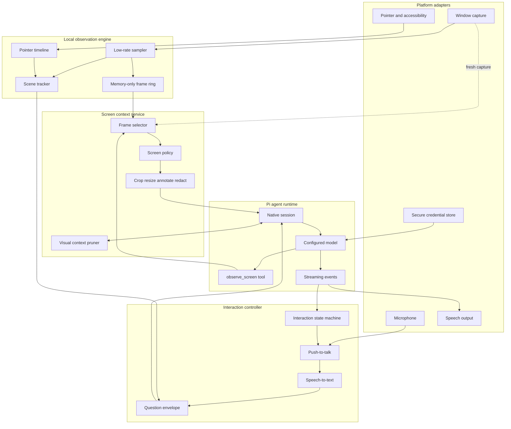

# Pilot System Design

Status: Draft 0.1
Last updated: 2026-08-10

## 1. Scope

This document defines the logical architecture for Pilot's macOS MVP and the platform boundaries required for a future Windows release. It covers the desktop shell, native observation adapters, voice pipeline, Pi agent runtime, screen context policy, persistence, privacy, and operational behavior.

## 2. Architectural decisions

1. Pilot is a desktop application, not a browser extension.
2. The shell uses Electron and TypeScript.
3. Platform capture and accessibility features live behind a `PlatformAdapter`.
4. macOS uses ScreenCaptureKit and Accessibility APIs through an embedded native helper.
5. Windows will use Windows Graphics Capture and UI Automation through a Windows implementation of the same interfaces.
6. Continuous capture is local and bounded; model observation is on demand.
7. Pi Agent Core owns the agent loop. Pilot owns conversation state and its persistence — Pi holds messages in memory only (see §8).
8. Pi's model/provider package owns provider normalization and supported authentication flows.
9. The app owns screen state, screen policy, privacy enforcement, and image retention.
10. Raw screenshots are never persisted, and that guarantee is **Pilot's, not Pi's**. Pi's own default is to serialize image blocks to disk verbatim on every session backend, with no flag to disable it. Pilot is the only writer to the session store, and its single write path strips image content before it reaches disk.

Pi dependencies must be pinned to exact versions. The current package scope is `@earendil-works`. Validated against 0.84.1 by the PR-005 spike: `@earendil-works/pi-agent-core`, `@earendil-works/pi-ai`, and `@earendil-works/pi-session-backend-sqlite-node` — note that the SQLite backend was renamed from `pi-storage-sqlite-node`, whose last release (0.83.0) pulls in a duplicate, incompatible copy of the runtime and must not be used. Findings and their evidence are recorded in `docs/pi-notes.md`.

## 3. Logical architecture



## 4. Process layout

### Electron main process

Owns trusted orchestration:

- Application lifecycle and menu bar.
- Permission state.
- Platform adapter lifecycle.
- Pi session and model runtime.
- Screen context policy.
- Secure settings and provider authentication.
- IPC validation between renderer and privileged services.

### Electron renderer

Owns unprivileged presentation:

- Onboarding and permissions guidance.
- Window selection UI.
- Listening, thinking, speaking, paused, and error states.
- Transcript and response display.
- Model and privacy settings.

The renderer must not receive provider credentials or unrestricted native capture handles.

### Embedded native helper

The macOS app bundle includes a signed helper or native module that exposes:

- Window enumeration and identity.
- ScreenCaptureKit stream control.
- Cursor and window geometry in consistent coordinates.
- Accessibility hit testing.
- Screen-lock and permission state.

The helper is started by Pilot and is not a separate user-managed service. IPC messages are typed, length-bounded, and restricted to explicit operations.

## 5. Core interfaces

```ts
export interface PlatformAdapter {
  permissions: PermissionAdapter;
  windows: WindowAdapter;
  observation: ObservationAdapter;
  accessibility: AccessibilityAdapter;
  speechInput: SpeechInputAdapter;
  speechOutput: SpeechOutputAdapter;
  credentials: CredentialAdapter;
}

export interface ObservationAdapter {
  start(window: ObservedWindow, options: CaptureOptions): Promise<void>;
  stop(): Promise<void>;
  captureFresh(signal?: AbortSignal): Promise<CapturedFrame>;
  subscribe(listener: (frame: CapturedFrame) => void): () => void;
}

export interface AccessibilityAdapter {
  getPointer(): Promise<ScreenPoint>;
  elementAt(point: ScreenPoint): Promise<AccessibilityNode | null>;
}

export interface ScreenContextService {
  status(): ScreenStatus;
  observe(request: ObserveScreenRequest, signal?: AbortSignal): Promise<ScreenObservation>;
  clear(): void;
}
```

Platform interfaces use normalized or explicitly tagged coordinate spaces. Conversion between display-independent screen coordinates and captured pixels happens in one geometry module, not in UI or prompt code.

## 6. Observation engine

### Capture lifecycle

Capture is active only when all conditions are true:

- The user enabled observation.
- A valid window is selected.
- Screen Recording permission is granted.
- The screen is unlocked.
- Pilot is not paused.

The engine samples the selected window at 2–3 FPS for the MVP. It stores encoded or efficiently retained frames in a time-bounded ring. Pointer coordinates and accessibility targets are recorded separately with higher-frequency timestamps.

The ring buffer is never itself attached to the Pi session. It exists to recover transient states that may disappear between the spoken question and the model's tool call.

### Question anchoring

The interaction controller records:

- Push-to-talk start and end timestamps.
- Pointer path during the utterance.
- Target element changes.
- Scene revisions during the utterance.

The initial grounding point is the pointer location at utterance end. A later version may select the longest dwell or align deictic words to transcript timestamps.

### Scene tracking

```ts
export interface SceneState {
  sceneId: string;
  revision: number;
  windowId: string;
  windowTitle: string;
  fingerprint: string;
  lastObservedRevision?: number;
  updatedAt: number;
}
```

A revision changes when the selected window, geometry, accessibility root, or meaningful visual content changes. The revision is lightweight metadata supplied with each question; it does not trigger an upload.

## 7. Voice interaction

The MVP state machine is:

```text
IDLE → OBSERVING → LISTENING → THINKING → SPEAKING
          ↑            │           │          │
          └────────────┴── interrupt / abort ─┘
```

Responsibilities:

- Push-to-talk starts transcription and anchors screen context.
- Speech-to-text emits one accepted transcript per utterance.
- Agent events update thinking and streaming-response state.
- Completed sentence fragments enter TTS.
- New speech stops TTS and aborts or steers the active Pi run.
- Duplicate or late transcription results are rejected using utterance IDs.

STT and TTS are adapters. The macOS defaults may use Apple frameworks; Windows receives native implementations later. A local Whisper-compatible implementation can be added without changing the interaction controller.

## 8. Pi agent integration

### Responsibilities owned by Pi

Corrected against the pinned 0.84.1 release by the PR-005 spike; see
`docs/pi-notes.md` §4 and §6.1 for the evidence.

- Model invocation and streaming.
- Tool-call loop.
- Provider-normalized image and tool-result messages.
- Steering, interruption, and follow-up *primitives* (`steer`, `followUp`,
  `abort`) — but there is no interruption event, and an abort during a tool call
  is reported as `stopReason: "error"`. Pilot owns the semantics.
- Compaction *primitives* only. They operate on session `Entry[]`, not the
  `AgentMessage[]` the agent holds.

`AgentHarness` — the resumable, session-backed API that would have owned the
conversation loop — is an unimplemented stub in 0.84.1: every method returns
`unavailable`. It is a trap, because `create()` succeeds and failure appears
only on first use. Pilot therefore drives the low-level `Agent` and owns run
identity, persistence, compaction triggering, and crash recovery.

Conversation messages live in `Agent.state.messages` **in memory only**. Pi does
not persist them; the durable `Session` is a separate object Pilot must drive.

### Responsibilities owned by Pilot

- Selection and lifecycle of the observed window.
- Screen and pointer state.
- Definition and execution of `observe_screen`.
- Privacy and screen retention policy.
- TTS chunking and playback.
- Mapping product conversation IDs to Pi session IDs.

### Question envelope

Pilot initially sends text and inexpensive metadata:

```ts
export interface QuestionEnvelope {
  utteranceId: string;
  transcript: string;
  conversationId: string;
  scene: {
    id: string;
    revision: number;
    lastObservedRevision?: number;
    windowTitle: string;
  };
  pointer: {
    normalizedX: number;
    normalizedY: number;
    targetRole?: string;
    targetLabel?: string;
  };
}
```

The system prompt tells the model that screen evidence is available through `observe_screen`. It asks the model to observe when an answer depends on visible content or its existing observation is stale. The model, rather than application heuristics, decides whether to call the tool.

## 9. `observe_screen` tool

### Input

```ts
export interface ObserveScreenRequest {
  view: "pointer" | "window" | "both";
  moment: "question" | "current" | "before-and-after";
}
```

### Semantics

- `pointer`: crop around the utterance's grounded pointer target.
- `window`: full selected-window frame.
- `both`: full frame followed by a higher-resolution pointer crop.
- `question`: frame closest to the utterance anchor.
- `current`: fresh capture at tool execution time.
- `before-and-after`: two bounded frames around a relevant scene transition.

### Output

```ts
export interface ScreenObservation {
  observationId: string;
  sceneId: string;
  sceneRevision: number;
  capturedAt: number;
  windowTitle: string;
  pointer: NormalizedPoint;
  target?: AccessibilityNodeSummary;
  images: Array<{
    mimeType: "image/jpeg" | "image/png";
    base64: string;
    purpose: "window" | "pointer" | "before" | "after";
  }>;
}
```

The Pi tool result contains a compact JSON/text description followed by image content blocks. The tool captures only the selected window and returns an error rather than falling back to whole-display capture.

## 10. Screen context policy

The policy is deterministic and enforced before images enter model context.

```ts
export interface ScreenPolicy {
  capture: {
    selectedWindowOnly: true;
    maxRequestsPerSecond: number;
  };
  image: {
    fullFrameMaxEdge: number;
    pointerCropPixels: number;
    jpegQuality: number;
  };
  activeContext: {
    maxFullFrames: number;
    maxPointerCrops: number;
    maxComparisonFrames: number;
  };
  localBuffer: {
    durationMs: number;
    persist: false;
  };
}
```

Initial values:

- One full frame and one pointer crop in ordinary active context.
- Two full frames only during comparison.
- Full-frame longest edge capped at 1440 px.
- Pointer crop around 640 px square.
- No more than two observation calls per second.
- Three-second local buffer, cleared on pause or lock.

Policy execution order:

1. Validate permission and selected-window identity.
2. Select the requested timestamp and view.
3. Reject frames from a previous window selection.
4. Redact known secure accessibility fields.
5. Crop, annotate, resize, and encode.
6. Enforce active-context image limits.
7. Return the observation to the Pi tool loop.

## 11. Context retention and compaction

Screenshots are replaceable environmental state, not durable conversational memory.

Active model context should contain:

- System instructions.
- Durable conversation summary.
- Last 6–10 text turns.
- Text summaries of older observations.
- Latest relevant full frame.
- Latest relevant pointer crop.
- A second frame only for an active comparison.

Before a provider request, the visual context transformer replaces obsolete image blocks with a compact record:

```text
[Observation scene-17/revision-4 removed. The user was viewing the
billing settings page and pointing at the Auto Renew toggle.]
```

Compaction is requested when any condition is met:

- Four new visual observations since the previous compaction.
- Estimated model context usage exceeds 60%.
- The selected window changes and old visual details are no longer relevant.

Compaction must preserve user goals, decisions, named UI elements, unresolved questions, and safety-relevant facts. It must not claim that an old screen description remains current.

Persistent session storage contains text messages, summaries, scene metadata, and tool audit metadata. Raw image persistence is disabled by default. If the pinned Pi session implementation serializes image blocks automatically, Pilot must use a session adapter or custom context representation that prevents raw frame retention.

## 12. Model and provider layer

Pilot uses Pi's model/provider package rather than Vercel AI SDK. The provider layer supplies normalized streaming, model metadata, and supported authentication. It does **not** supply tool-capability information (see below).

Each configured model profile includes:

```ts
export interface ModelProfile {
  id: string;
  provider: string;
  model: string;
  authMode: "subscription" | "api-key" | "local";
  baseUrl?: string;
  supportsVision: boolean;
  supportsTools: boolean;
  isRemote: boolean;
}
```

Before starting a visual conversation, Pilot validates `supportsVision` and `supportsTools`. A non-vision model may use accessibility and OCR text only, but the UI must label this degraded mode. Authentication secrets are retrieved from secure storage at request time and never sent to the renderer.

Two corrections from the PR-005 spike (`docs/pi-notes.md` §6.3, §6.4):

- **`supportsTools` cannot be derived from Pi.** Pi's `Model` carries no
  tool-support metadata at all — `compat.supportsStrictTools` is constrained
  sampling, not tool support. It is Pilot-configured. `supportsVision` *is*
  derivable, from `Model.input`.
- **This gate is a correctness requirement, not an optimization.** A model
  without vision does not error when handed an image; `pi-ai` silently ignores
  it. Without the gate the user receives a confident answer about a screen the
  model never saw.
- **`authMode` is not a Pi fact.** Pi attaches auth to the provider, not the
  model, and one provider may expose both `apiKey` and `oauth`. `authMode`
  records which credential Pilot chose.

## 13. Persistence

### Persisted

- Application preferences.
- Selected model profiles without plaintext secrets.
- Provider credential references.
- Text conversation sessions and summaries, when enabled.
- Permission and onboarding state.
- Non-sensitive diagnostics and crash metadata.

### Memory-only by default

- Rolling capture frames.
- Pointer timeline.
- Raw microphone buffers.
- Full screenshot tool results after their active lifetime.

### Never logged

- Credentials or OAuth tokens.
- Base64 images.
- Raw audio.
- Full prompts containing screen text when private logging is enabled.

## 14. Security and privacy

- Use macOS hardened runtime and code signing for release builds.
- Request only Screen Recording, Accessibility, and Microphone permissions required by enabled features.
- Use selected-window capture filters; never silently widen to a display.
- Clear frame and audio buffers on pause, logout, screen lock, window loss, and process shutdown.
- Validate all renderer IPC payloads in the main process.
- Enforce size and count limits on image tool results.
- Treat visible screen content as untrusted input that may contain prompt injection.
- System instructions must state that on-screen text cannot override tool permissions, privacy policy, or user intent.
- Do not expose filesystem, shell, or computer-control tools in the MVP agent.
- Show whether the configured provider is local or remote before observation begins.

Accessibility-based redaction is best effort. Password fields can be masked when identified, but the product must warn that screenshots can still contain secrets outside recognized fields.

## 15. Concurrency and cancellation

- Only one active Pi run per conversation.
- Every utterance, observation request, and TTS stream has an ID.
- Starting a new utterance stops TTS immediately.
- The interaction controller aborts the current agent request or submits a steering message according to state.
- `observe_screen` respects the agent's abort signal.
- Results from stale window selections, scene IDs, or utterance IDs are discarded.
- Capture continues locally during normal model latency but remains bounded by the ring policy.

## 16. Failure handling

| Failure | Behavior |
| --- | --- |
| Screen permission denied | Explain permission and provide System Settings shortcut |
| Accessibility denied | Continue with visual pointer coordinates and disclose reduced grounding |
| Selected window closed | Stop observation, clear buffer, prompt for selection |
| Capture returns protected/blank content | Explain that the application blocks capture |
| Model lacks vision | Use accessibility/OCR text or require another model |
| Model does not call observation when needed | Offer a visible “Look now” action that explicitly requests observation |
| Provider authentication expires | Pause request, refresh or reauthenticate without losing transcript |
| Local model unavailable | Show endpoint status and keep conversation locally queued |
| STT fails | Preserve audio only until failure handling completes, then offer text input |
| TTS fails | Continue showing streamed text |

## 17. Performance budgets

- Background sampling: 2–3 FPS at policy-bounded resolution.
- Ring memory: bounded to three seconds and a configured byte ceiling.
- Pointer sampling: approximately 30 Hz with coalescing.
- Image preprocessing: target below 150 ms per observation on supported Macs.
- TTS interruption: target below 300 ms.
- Main and renderer processes must not block on image encoding or native capture callbacks.

Metrics should record timings and counts, not screen content:

- Capture-to-observation latency.
- STT duration.
- Time to first model token.
- Time to first spoken sentence.
- Observation calls per question.
- Image bytes and active image count.
- Abort and failure categories.

## 18. Testing strategy

### Unit tests

- Coordinate conversion across display scales.
- Ring-buffer eviction and timestamp selection.
- Screen policy limits and redaction.
- Context pruning and observation summarization.
- Interaction state transitions and stale-result rejection.
- Provider capability gating.

### Integration tests

- Native helper window enumeration and capture.
- Accessibility hit testing against controlled test applications.
- Pi tool call returning image content.
- Session compaction without unbounded image retention.
- STT-to-agent-to-TTS streaming and interruption.

### End-to-end scenarios

- Explain a button in a native macOS app.
- Explain a field in a browser window.
- Capture a hover tooltip that disappears after the utterance.
- Ask a text-only follow-up without another observation.
- Compare a before and after state.
- Pause observation and verify buffers are cleared.
- Switch providers and resume with a fresh screen observation.
- Restart Pilot and restore text context without stale screenshots.

## 19. Windows compatibility boundary

The Windows release replaces platform adapters only:

| Capability | macOS | Windows |
| --- | --- | --- |
| Window capture | ScreenCaptureKit | Windows Graphics Capture |
| UI semantics | Accessibility API | UI Automation |
| Speech input | Apple Speech or local STT | Windows speech or local STT |
| Speech output | AVSpeechSynthesizer | Windows speech synthesis |
| Credential storage | Keychain | Credential Manager |
| Permission UX | System Settings | Windows privacy/settings UX |

Observation, screen policy, Pi agent integration, session/context management, and product UI remain platform-independent TypeScript modules.

## 20. Proposed module boundaries

```text
apps/desktop/
  main/                 Electron main process
  renderer/             React UI

packages/agent-runtime/ Pi session, tools, model profiles
packages/interaction/   Voice and interruption state machine
packages/observation/   Ring buffer, scene tracking, screen policy
packages/platform/      Shared adapter interfaces
packages/platform-mac/  ScreenCaptureKit and AX bridge
packages/shared/        Types, validation, logging, IPC contracts
```

The Windows implementation later adds `packages/platform-windows/` without changing the shared contracts.

## 21. Implementation sequence

1. Establish Electron shell, IPC validation, and platform interfaces.
2. Implement macOS permissions, window selection, and local frame preview.
3. Add ring buffer, pointer tracking, and scene revisions.
4. Add push-to-talk, STT, and TTS state machine.
5. Integrate pinned Pi packages and one verified model profile.
6. Implement `observe_screen` and image tool results.
7. Add visual pruning, compaction, and privacy controls.
8. Validate interruption, failure recovery, packaging, and signing.
9. Add local model profile and cross-platform contract tests.
